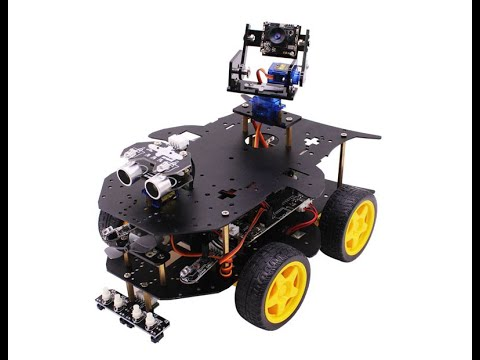
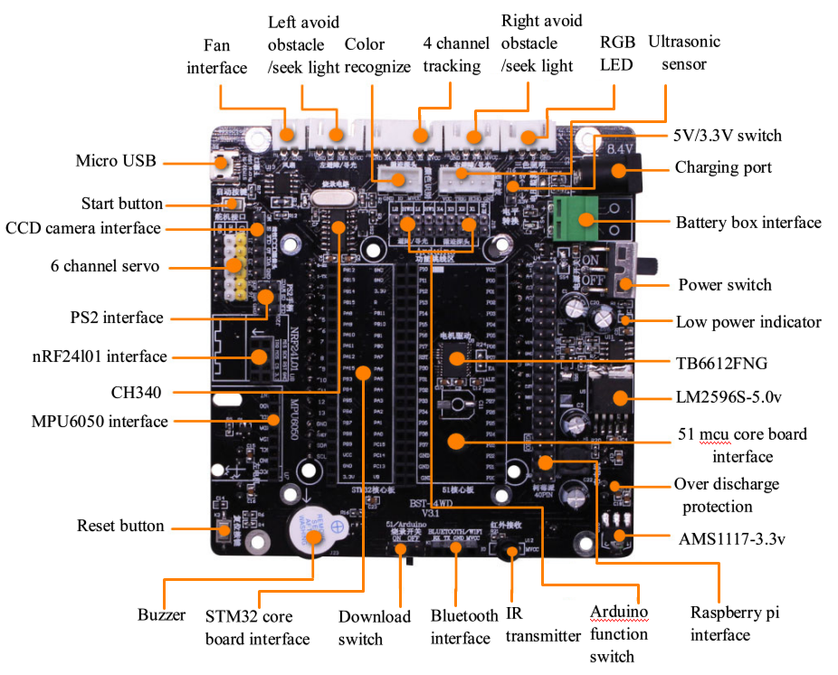
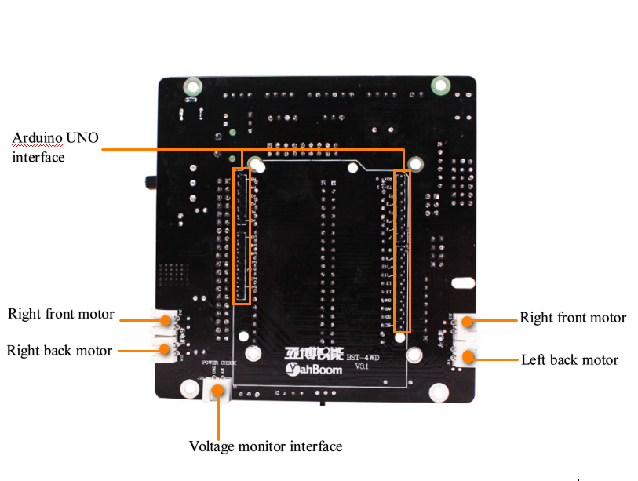
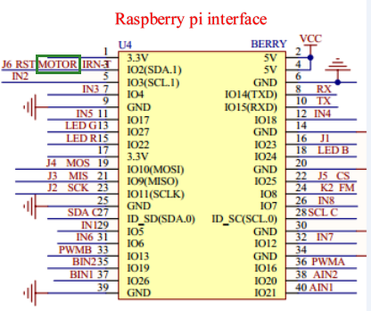

# Control code for a Yahboom 4wd robot

Here is the Yahboom 4WD robot: 

Here is the controller diagram (front):

and back:

And, most relevant to the programmer, the Raspberry Pi GPIO interface diagram:
